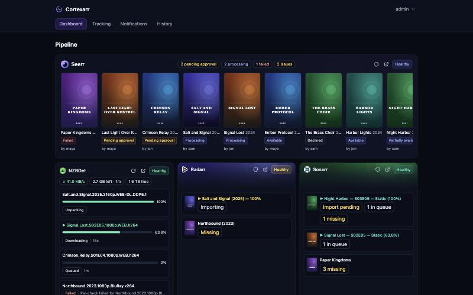
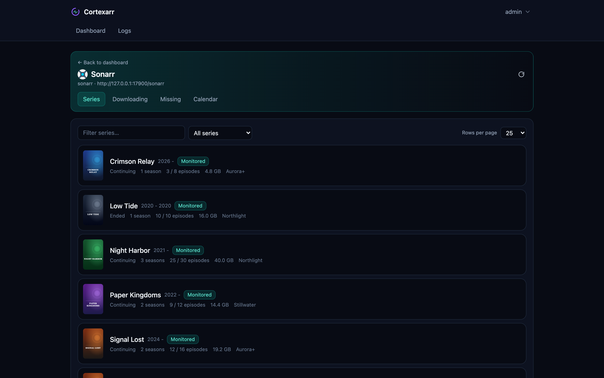
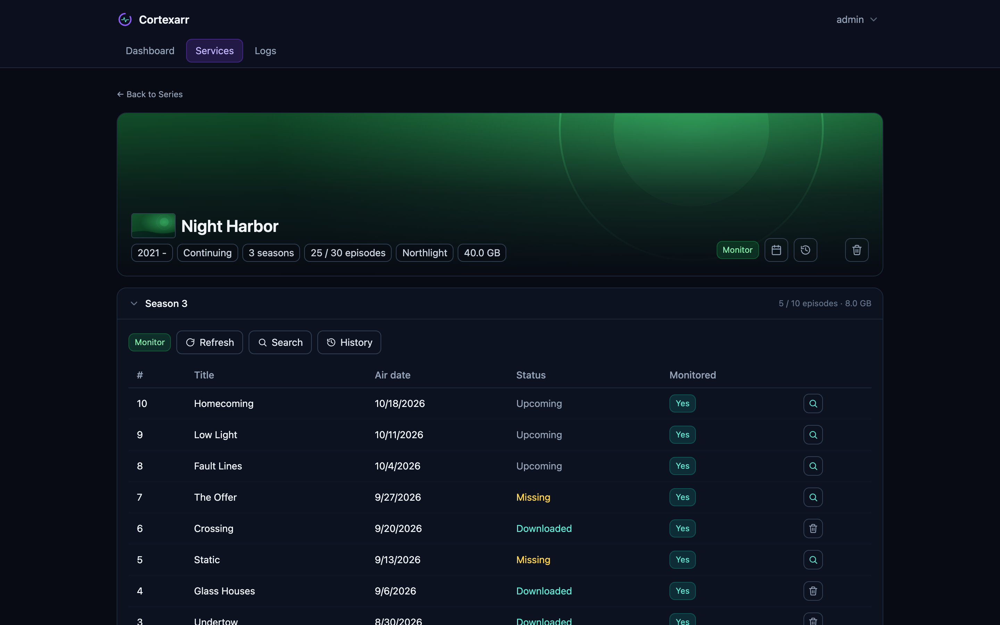
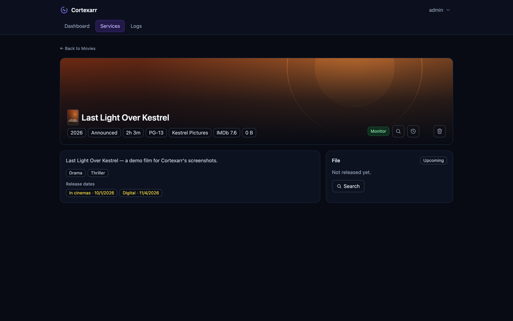
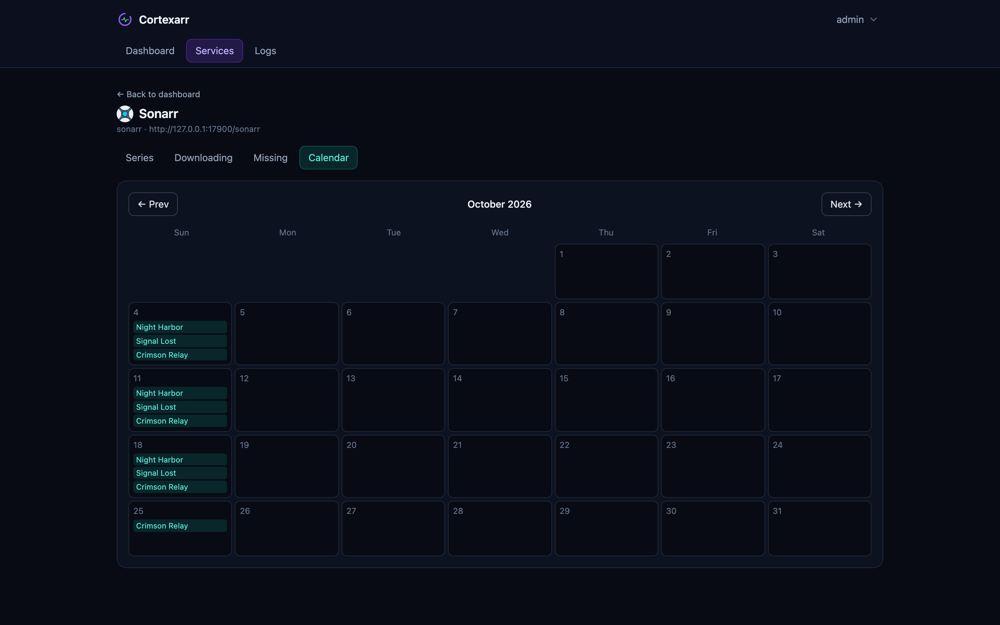
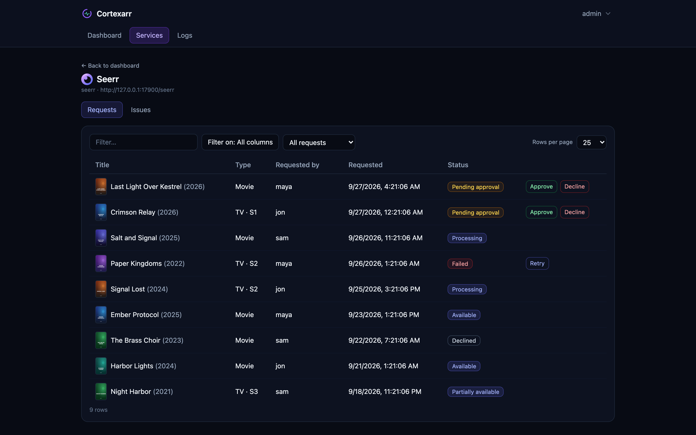
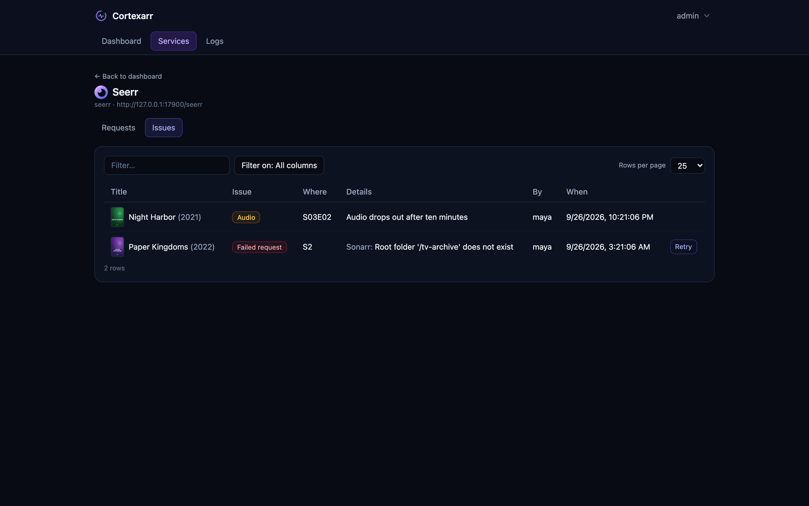
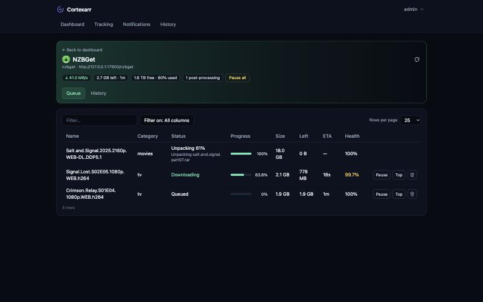
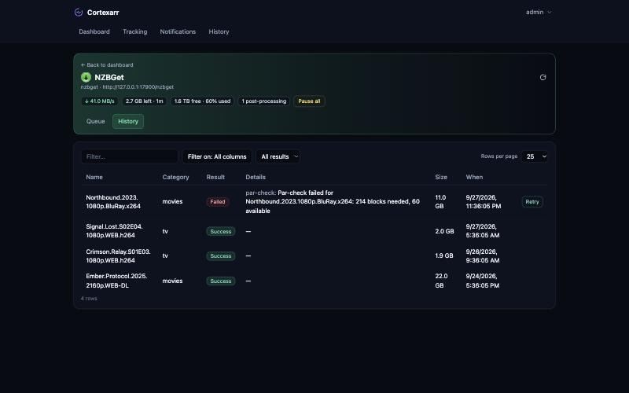
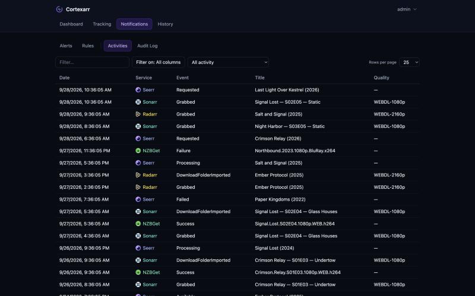

# Cortexarr — User Guide

## Your account

Click your username in the top-right corner for **Settings** — the
management hub, as tabs: **General** (time zone, retention, self-update),
**Notifications** (email/webhook/ntfy/SMS setup, digest window),
**Services**, **Users** (admins only), and **API tokens** — and, under
**User**, **My notifications**, **Change password**, and **Log out**.
Admins also see **New service** under Settings → Services (see the
[Admin Guide](ADMIN_GUIDE.md)).

The top-nav **Notifications** tab (next to Tracking) is where you watch,
not configure: **Alerts** (current problems, the alert rules, and what's
been sent — see the [Admin Guide](ADMIN_GUIDE.md#alert-rules)),
**Activities** and **Audit Log**.

## Dashboard

**Seerr** runs full width across the top: a strip of recent request
posters, with anything failed, waiting for approval, or processing first.
The counts across the middle (pending approval, processing, failed, issues) each
open that list.

Below it, each service has a card with its health and what needs attention
right now:

- **Sonarr** — a card per episode that's stuck or downloading, then a card
  per series with missing episodes. Click a card to open the series; the
  pills open the queue (filtered to that series) or the series at its first
  missing season.
- **Radarr** — a card per movie that's stuck, downloading, or missing.
  Click a card to open the movie; the pills open the queue (filtered to
  that movie) or the missing list.
- **NZBGet / SABnzbd** — speed, time left, and free disk, then a card per
  download with its progress, and any download that failed in the last day
  with the reason.

Every service shows one of:

- **Healthy** — reachable, no issues reported.
- **Warning** / **Error** — reachable, but the service itself reported a
  problem (e.g. an indexer error in Sonarr, a news-server login failing in
  SABnzbd).
- **Unreachable** — Cortexarr couldn't reach it, or the key/login was
  rejected. Check the URL and key rather than the service's own health.
- **Maintenance** — checks are paused; excluded from the overall status.

Beside the status, the refresh icon reloads just that card now rather than
waiting for its next update, and the arrow icon opens the service's own web
UI in a new tab. Click anywhere else on a card to open that service's page.

## Tracking

**Tracking** (top of the page) follows every Seerr request through the
pipeline: *Waiting for approval → Sending to Sonarr/Radarr → Searching →
Downloading → Importing → Available*. The current stage is lit, with how
long the request has been in it — measured from when it really got there
(requested, approved, added to Sonarr/Radarr, download started), not from
when Cortexarr noticed. TV requests show how many of the requested seasons'
aired episodes are on disk.

A title that isn't released yet shows as *Not released yet* rather than
searching; a request Seerr failed to send shows as *Failed in Seerr* (see
Alerts for why).

The dropdown at the top right filters the list — **In progress** (the default),
**All**, each stage, *Not released yet*, *Failed in Seerr* — each with its
count; the filter is kept in the page address, so a view can be bookmarked.
When a filter mixes stages, *Not released yet* always sorts to the bottom —
it isn't a problem, so it never sits above one.

Click a request to go straight to it where it's at in the pipeline:
waiting for approval opens Seerr's pending requests; downloading or
importing opens Sonarr/Radarr's Downloading tab filtered to that title;
searching (or available) opens the series — at the first requested season —
or the movie; failed opens Seerr's Issues, with the reason.

To be told when a request sits in one stage too long, add a *Request …*
alert rule (Admin Guide → Alert rules) — its "for at least" is that stage's
threshold.

A request badged **Seerr says available** means Seerr's own status has
gone stale — it's showing the title as available, but Sonarr/Radarr hasn't
actually found a release for it. **Search again** tries once more; if
nothing turns up, the indexers may not have it, or the quality profile may
be too strict.

## History

**History** shows the same signals as the rest of the app, but over time
instead of live: pick a 7/30/90-day range at the top right.

- **Service uptime** — one card per service, the overall uptime % for the
  range plus a small trend chart of each day's percentage. This reads the
  same health checks the Dashboard's status pills use, kept for as long as
  Settings → General's retention setting allows.
- **Alert frequency** — a bar per day of how many alerts fired, plus the
  rules and services responsible for the most of them.
- **Requests completed** — how many requests reached *Available* in the
  range, the average time from request to available, and a breakdown by
  TV/movie. This one only fills in going forward: nothing before History
  shipped was recorded, since nothing tracked *when* a request finished
  until now.

## Service pages

The refresh icon at the right of a service page's header reloads that page
— the overview strip and the tab you're on.

Tables can be searched, sorted by clicking a column header, and paged;
the series and movie libraries can be searched, filtered, and paged.
Deleting a series, movie, file, or download asks you to type `Delete` to
confirm.

### Sonarr

- **Series** — your library, filterable by monitored / unmonitored /
  continuing / ended / missing episodes. Filtering to missing episodes adds
  a checkbox to each series and a **Search all missing** button, so you can
  select several and search all of them in one go instead of one at a time.
  Open a series for its seasons (newest first, Specials
  last): monitor a whole series or season, search a season, see its
  history, and open a season for its episodes — each with its own monitor
  toggle, a search button when it's missing (it spins while Sonarr searches,
  then shows what Sonarr found), or delete-file when it's
  there. An *Upcoming* episode opens the series calendar at its month.
  On a series page, click its *episodes* pill (e.g. "292 / 303 episodes") to
  show only missing episodes, again for only downloaded ones, and again for
  everything.
- **Downloading** — the queue (with why an item is stuck, if it is) and
  recent history.
- **Missing** — aired episodes with no file, grouped by series; each links
  to its season.
- **Calendar** — a month grid of upcoming and missing episodes; click one
  to jump to its series and season.

Removing a series from Sonarr does not delete its files from disk. If it
has a matching Seerr request, the delete confirm offers removing that too
— ticked by default, so Seerr doesn't keep thinking it's wanted and quietly
try to fill it again.

### Radarr

- **Movies** — your library, filterable by monitored, downloaded, missing,
  released, or not yet released. Open a movie for its details, the file on
  disk (with delete-file), its release dates, and monitor / search /
  history / delete. An upcoming release date links to that month on the
  calendar.
- **Downloading** — the queue and recent history.
- **Missing** — released movies with no file, with search and a monitor
  toggle on each.
- **Calendar** — a month grid of release dates (in cinemas, digital,
  physical).

Removing a movie from Radarr does not delete its files from disk. Same
Seerr-request cleanup offer as Sonarr, if it was requested.

### Seerr

- **Requests** — recent requests: title, movie or TV (with seasons), who
  asked, when, and status. A request still pending approval has
  **Approve** / **Decline**; a failed one has **Retry**, which sends it to
  Sonarr/Radarr again.
- **Issues** — requests that failed to reach Sonarr/Radarr, with the reason
  from Seerr's log when it still has it, and **Retry** — plus problems users
  reported against a title (bad video, missing audio, wrong subtitles).

### NZBGet / SABnzbd

A status bar across the top shows current speed, what's left (with an
estimated time), free disk space, anything post-processing, and **Pause all
/ Resume all**.

- **Queue** — downloads in the client's own order with progress, time
  left, and (NZBGet only) health, followed by anything still post-processing
  (verifying, repairing, unpacking). A download can be paused, resumed,
  moved to the top, or deleted — NZBGet moves a deleted download to its
  history; SABnzbd removes it but keeps any files already downloaded.
- **History** — each finished download's result, filterable by result.
  Failed ones show why (NZBGet: from that download's own log; SABnzbd: its
  failure message) and can be **retried**.

## Notifications (Alerts, Rules, Activities, Audit Log)

Top nav → **Notifications**, next to Tracking. Four sub-tabs:

- **Alerts** — current problems, and what's been sent.
- **Rules** — the alert rules that decide what notifies. See the
  [Admin Guide](ADMIN_GUIDE.md#alert-rules) for the details.
- **Activities** — one feed across every service: what Sonarr and Radarr
  grabbed and imported, request changes in Seerr, and finished downloads.
  The dropdown narrows it to one pipeline (Series, Movies, Requests,
  Downloads — only the ones you've added appear).
- **Audit Log** — every change made in Cortexarr, who made it, and when:
  services added or changed, monitor toggles, searches, deletes, approvals.

## My notifications

User menu → *User* → **My notifications** is where *you* get alerts: your
own email address, Slack/Discord webhook, ntfy topic, or phone number, each
turned on or off separately. Alerts go to these as well as to the
recipients an admin set under Settings; what triggers an alert is the
rules under Notifications.

A channel only works once an admin has set it up under Settings — the page
says so when one isn't. Each address is checked when you save it (a real
email address, an http(s) webhook URL, an ntfy topic name, a phone number
in international format like +15551234567). **Send me a test** sends to
your address only, not to anyone else's.

## API tokens and AI tools

Cortexarr is an MCP server: an AI tool that speaks MCP can check your
pipeline's health, look through queues, libraries, requests and history,
and — with the right token — act on them, the same as you can in the web UI.

Settings → **API tokens** → **New token**. Give it a name you'll recognise
and an expiry, then copy the token straight away — it's shown only once.
The page also gives a ready-made client config: the server URL is
`http(s)://<your Cortexarr>/mcp`, and the token goes in an
`Authorization: Bearer <token>` header.

- **Read** tokens can only look. Anyone can make one.
- **Write** tokens can also change things — monitor, search, approve,
  pause, change settings. Admins only, because every write is admin-only.
- **Allow destructive tools** (admins, write tokens only) adds deleting
  services, series, movies, files, and downloads. The AI tool won't ask
  before it does, so leave this off unless you need it.

A token acts as you: anything it changes shows in the audit log as
`<you> (MCP: <token name>)`. **Revoke** stops a token immediately.
**Reissue** rolls a new secret onto the same token — same name, access, and
expiry — for when it just needs rotating rather than removing; the old
secret stops working the moment you do. A token can't change your password
or make other tokens.

